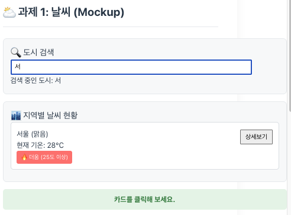
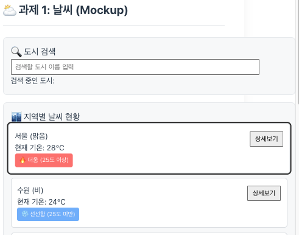
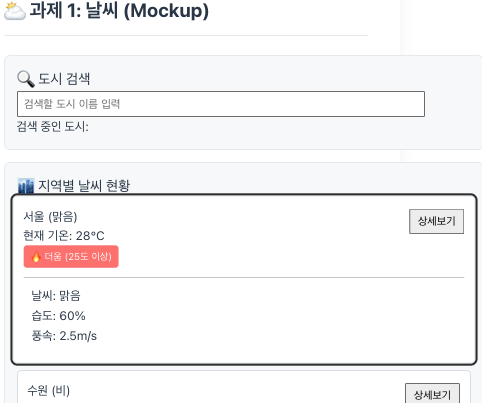
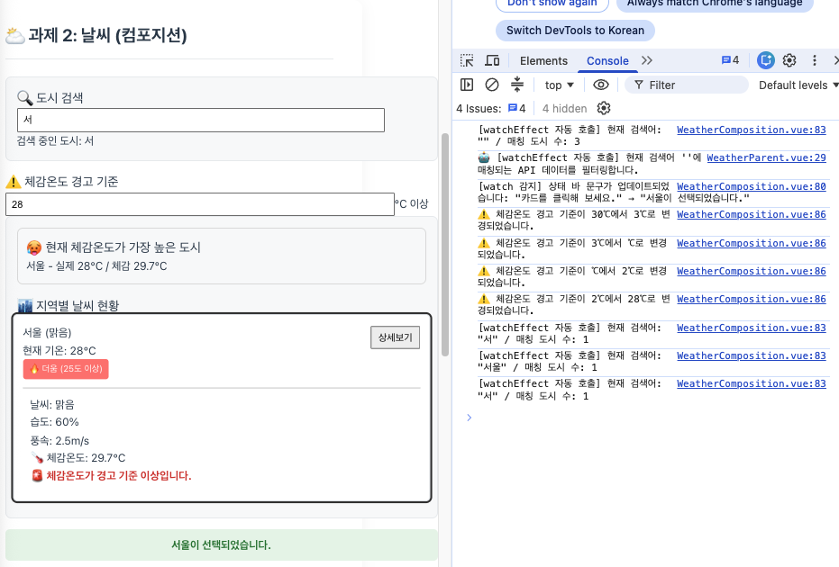
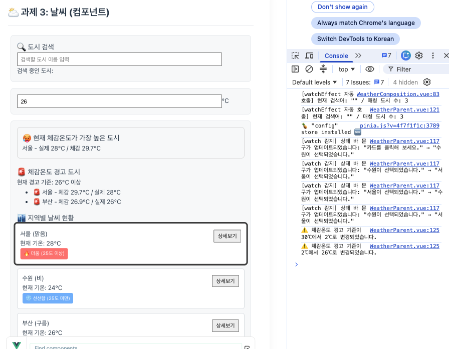
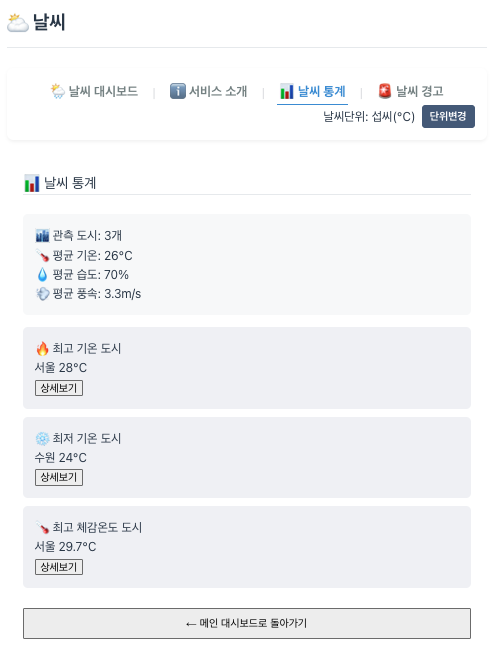
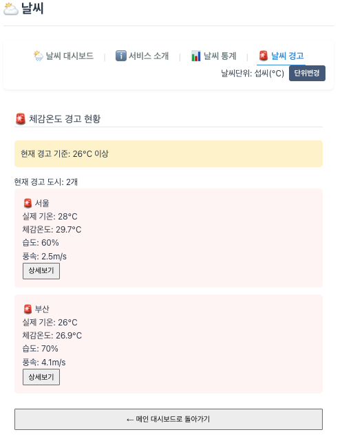
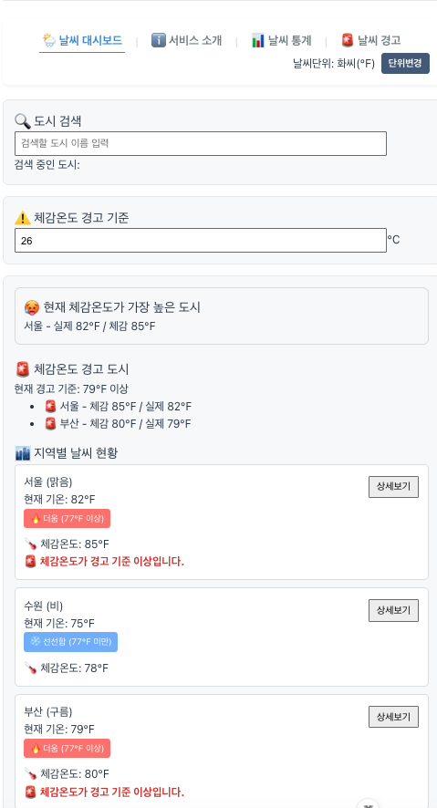
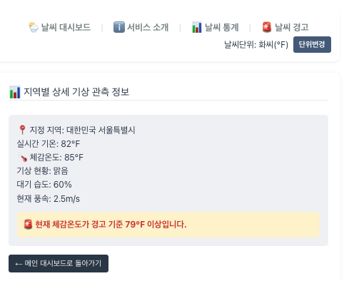

따로 하고있는 프로젝트 포트번호랑 겹쳐서 포트번호를 3001번으로 했습니다.

# 실습1. Weather Mockup(WeatherMockup.vue 수정)

1. 배열 렌더링 : v-for 이용, 임의의 날씨 데이터 배열을 활용해 화면에 날씨 카드를 반복 출력한다.key='city.id'
2. 조건부 렌더링 : v-if이용, 온도에 따라 라벨 붙이기
3. 양방향 바인딩 및 한글처리 : :value, @input이용, 도시 이름을 한글로 검색하는 input이용
4. 이벤트 및 수식어 :

- 지역별 날씨 현황 카드를 누르면 상태바에 “{도시}이 선택되었습니다.” 표기
- 지역별 날씨 현황 카드 내부의 [상세보기] 버튼을 누르면 버블링 없이 해당 도시의 날씨 내용을 window.alert로 띄운다.
- ref('')를 만든뒤 v-model로 양방향 연결

5. 본인만의 데이터 추가하고 이를 기초로 목업 추가

- 도시검색 필터
  - v-model.trim으로 검색어를 입력받음.
  - v-if="city.name.includes(searchCity)"를 이용하여 검색어가 포함된 도시만 화면에 표시.
  - 검색어가 변경되면 Vue의 반응형 상태에 따라 화면도 자동으로 변경 확인.
    
- 선택된 카드 강조
  - 현재 선택된 도시의 ID를 selectedCityId에 저장.
  - 카드를 클릭하면 선택한 도시 ID와 상태 문구를 변경.
  - 현재 카드의 ID와 selectedCityId가 같으면 selected 클래스를 추가하여 CSS로 강조.
    

- 상세정보 펼치기/접기
  - detailCityId에 현재 상세정보가 열린 도시 ID를 저장.
  - toggleDetail() 함수에서 같은 카드를 다시 누르면 닫고, 다른 카드를 누르면 해당 도시의 상세정보를 표시.
  - v-show를 이용해 상세정보 영역의 표시 여부를 제어.
    

# 실습2. Weather Composition (WeatherComposition.vue 파일 수정)

1. 반응형 상태 3개 만들기
2. 검색 도시 (computed 활용)
3. 반응형 변수 변화 감시 (watch, watchEffect)
4. 검색 결과 표시 (Template 영역)

5. 본인만의 반응형 상태 변수, Computed, Watcher를 추가한다.

- 체감온도 및 기상 경고 기능 추가
  - weatherList의 기온·습도·풍속 데이터를 기반으로 computed()에서 도시별 체감온도를 계산하고, 실제 기온과 함께 화면에 표시. 사용자가 설정한 체감온도 경고 기준은 ref()로 관리하고, watch()를 이용해 기준값 변경 시 후속 로그를 출력
    - 체감온도 AT = 기온 + 0.33 × 수증기압 - 0.70 × 풍속 - 4 으로 대충 계산
    - 체감온도 경고 기준 예: 30℃
    - computed
      - 각 도시의 체감온도 계산
      - 체감온도가 가장 높은 도시 계산
    - watch
      - 경고 기준이 변경되면 로그 출력
    - 각 도시의 체감온도가 사용자가 설정한 경고 기준 이상이면 v-if를 이용해 경고 메시지 표시

# 실습3. Weather Component (WeatherParent.vue 등 수정)

1. WeatherParent.vue

- 모든 반응형 데이터 유지

2. BaseDashboardCard.vue

- 검색박스와 리스트박스의 디자인을 공통화.
- <slot> 배치하여 부모 컴포넌트가 도시 검색, 날씨 현황 주입

3. SearchBar.vue

- 부모로 부터 검색도시 반응형 데이터를 전달받아 표시 (props)
- 도시 검색 시 update-query 이벤트를 발생하면서 검색어를 부모에게 전달 (emits)

4. WeatheCard.vue

- 선택된 도시 객체를 전달 받아 표시 (props)
- 카드를 선택하는 것(select-card 이벤트)과 상세보기(click-detail 이벤트)를 부모에게 전달
  (emits)

5. 각 컴포넌트로 분리하면서 Component에 해당되는 디자인은 <style scoped>로 각각 분리
6. [참고] Slot으로 전달되는 자식 컴포넌트(SearchBar, WeatherCard)는 시각적으로는
   BaseDashboardCard 내부에 위치하지만, 스크립트적으로는 부모 컴포넌트의 스코프에서 컴파
   일되고 평가되므로, WeatherParent에서 SearchBar와 WeatherCard와 직접 바인딩/통신이 가능
   하다.
7. 본인의 Mockup 부분에서 추가로 Component하거나 위의 Component를 더 분리하여 추가
   Component를 만든다.

- 먼저 실습 2에서 작업했던 체감온도 관련 기능들을 WeatherParent.vue로 옮긴다.
  - weatherList, 검색어, 선택된 도시, 상세보기 상태, 체감온도 경고 기준 등의 상태를 부모에서 관리
  - computed()를 이용해 체감온도 계산 결과, 검색 결과, 최고 체감온도 도시, 경고 기준 이상 도시 목록을 계산
  - 각 자식 Component에는 필요한 값만 Props로 전달하고, 사용자 이벤트는 Emits로 부모에게 전달
- WeatherCard.vue
  - 기존 도시별 날씨 카드를 유지하면서 상세 기능을 추가
  - Props
    - cityItem: 도시 날씨 객체
    - selected: 현재 선택된 카드인지 여부
    - detailOpen: 상세정보 표시 여부
    - feelsLikeThreshold: 체감온도 경고 기준
  - Emits
    - select-card: 카드 클릭 시 cityItem을 부모에게 전달
    - click-detail: 상세보기 클릭 시 cityItem을 부모에게 전달
  - 상세보기 버튼의 .stop을 유지하여 버튼 클릭 이벤트가 카드 클릭 이벤트까지 전파되지 않도록 처리
  - 습도, 풍속, 체감온도 및 경고 문구를 상세정보 영역에 추가
- FeelsLikeThreshold.vue
  - 체감온도 경고 기준 설정 영역을 별도 Component로 분리
  - Props
    - threshold: 부모가 관리하는 현재 체감온도 경고 기준
  - Emits
    - update-threshold: 사용자가 입력한 새로운 경고 기준값을 부모에게 전달
  - 부모는 전달받은 값으로 feelsLikeThreshold 상태를 변경
- HottestCity.vue
  - 현재 체감온도가 가장 높은 도시를 표시하는 영역을 별도 Component로 분리
  - Props
    - city: 부모의 hottestFeelsLikeCity에서 계산된 도시 객체
  - 별도의 사용자 입력이 없으므로 Emits 없이 Props를 이용해 결과만 출력
- HeatWarningList.vue (신규 기능)
  - 현재 체감온도가 설정된 경고 기준 이상인 도시 목록을 표시
  - 부모의 warningCities에서 weatherWithFeelsLike와 feelsLikeThreshold를 이용해 대상 도시를 계산
  - Props
    - cities: 체감온도가 경고 기준 이상인 도시 배열
    - threshold: 현재 체감온도 경고 기준
  - 별도의 상태 변경 없이 부모에서 계산된 값을 받아 목록으로 출력
  - Scoped Slot을 사용하여 반복 중인 city 데이터를 부모에 전달하고, 부모에서 각 경고 도시의 출력 형식을 결정할 수 있도록 구성 연습

- 최종적으로 WeatherParent.vue는 상태·계산·이벤트 처리 로직을 관리하고, 각 자식 Component는 Props로 필요한 데이터를 받아 화면을 표시하며 필요한 사용자 동작은 Emits로 부모에게 전달하도록 역할을 분리

# 실습4. Weather Router

1. Vue Router 설정 : 라우터 지연 로딩 적용, Catch-all Route 적용
2. App.vue : Navigation Bar 추가 (RouterLink) 및 메인 콘텐츠 영역 배치(RouterView)
3. WeatherHomeView.vue : WeatherParent 대체 (WeatherParent를 참고하여 / 경로에 맞게 작성)

- 상세보기 버튼 클릭 시 window.alert()를 제거하고, Programmatic Navigation 처리 (router.push('/weather/' + id))

4. WeatherDetailView.vue : 지역별 상세 기상관측 정보를 보여주는 페이지

- 도시 코드에 해당하는 Mock Data를 임시로 활용
- Router 동적 경로 매칭에 해당되는 도시ID (cityId)를 기반으로 Mount 시점에 Mock Data에서 도시 객체 선택

5. WeatherAboutView.vue : 적당한 내용 작성 및 메인 대시보드로 돌아가기 작성
6. 상기 정의된 view 이외에 본인의 추가 view 를 작성하고 Routing 한다.

- 추가 view 작성 전에 데이터를 통합 하고 싶음 -> 후에 배운 store 이용해봄
- weatherStore -> 상세내용은 실습5에서 설명

  현재

  WeatherHomeView
  → weatherList 따로 보유
  → 체감온도 계산 따로 보유
  → 경고 기준 따로 보유

  WeatherDetailView
  → mockDetails 따로 보유

  변경 후

                  weatherStore
                  ├─ weatherList
                  ├─ feelsLikeThreshold
                  ├─ 체감온도 계산 결과
                  ├─ 최고 체감온도 도시
                  └─ 경고 도시 목록
                        ↓
              ┌─────────┴─────────┐
              ↓                   ↓

        WeatherHomeView   WeatherDetailView

- WeatherStatsView (날씨 통계/평균)
  - router/index.js에 /stats 추가
  - WeatherStatsView.vue 작성
  - weatherStore의 날씨 데이터를 활용해 평균 기온·습도·풍속 및 최고/최저 도시 계산
  - 상세보기에서 /weather/:cityId로 이동
  - App.vue에 RouterLink로 /stats 연결
    

- WeatherWarningView (체감온도 경고 현황)
  - router/index.js에 /warnings 추가
  - WeatherWarningView.vue 작성
  - weatherStore의 warningCities, feelsLikeThreshold 활용
  - 경고 기준 이상인 도시의 기온·체감온도·습도·풍속 표시
  - 상세보기에서 /weather/:cityId로 이동
  - App.vue에 RouterLink로 /warnings 연결
    

# 실습5. Weather Store

1. UnitToggler.vue : 대시보드 상단에 배치되어 단위 설정을 변경하는 UI 버튼과 영역
2. Navigation Bar 옆에 UnitToggler.vue 배치
3. 메인과 상세 날씨에 단위 설정 변경 적용

- configStore의 unit, unitSymbol, toggleUnit() 활용
- WeatherCard.vue에 섭씨/화씨 변환 적용
- WeatherDetailView.vue에 섭씨/화씨 변환 적용
- computed()로 단위 변경 시 화면 온도 자동 갱신
- 원본 데이터와 경고 판정은 섭씨 기준 유지, 화면 표시값만 변환
- 중복되는 온도 변환 로직은 추후 Composable로 분리 가능

4. 본인만의 추가 Store를 작성하고 활용하거나, configStore에서 state, getter, action을 추가한다.

- weatherStore 추가 및 날씨 데이터 통합
- 공통 상태와 공통 계산 로직을 Store로 이동하여 View 간 데이터 중복을 제거하고, 각 View는 필요한 Store 데이터를 가져와 화면 표시와 페이지별 기능에 집중하도록 구성하였다.
  - state
    - weatherList
    - feelsLikeThreshold
  - getters
    - weatherWithFeelsLike : 각 도시의 체감온도 계산
    - hottestFeelsLikeCity : 최고 체감온도 도시
    - warningCities : 경고 기준 이상 도시 목록
    - getCityById : 도시 ID로 해당 도시 조회
    - cityCount : 전체 관측 도시 수
    - averageTemp : 평균 기온
    - averageHumidity : 평균 습도
    - averageWind : 평균 풍속
    - hottestCity : 최고 기온 도시
    - coldestCity : 최저 기온 도시
  - actions
    - updateThreshold() : 체감온도 경고 기준 변경
    - stores/weatherStore.js 생성
  - state에 weatherList, feelsLikeThreshold 저장
  - getters에 체감온도 계산, 최고 체감온도 도시, 경고 도시 목록, 도시 ID 조회 기능 작성
  - action으로 체감온도 경고 기준 변경 처리
  - WeatherHomeView.vue가 weatherStore의 공통 데이터를 사용하도록 수정
  - WeatherDetailView.vue의 별도 Mock Data를 제거하고 getCityById()로 Store 데이터 사용
  - 여러 View에서 동일한 날씨 데이터와 경고 기준을 공유하도록 구성
  - WeatherStatsView.vue에서 직접 계산하던 통계 로직을 Store의 getters로 이동
  - 관측 도시 수, 평균 기온·습도·풍속, 최고·최저 기온 도시를 Store에서 공통 계산
  - WeatherStatsView.vue는 통계 계산을 직접 하지 않고 weatherStore의 getter 결과를 화면에 출력하도록 수정
  - WeatherWarningView.vue에서도 warningCities, feelsLikeThreshold를 사용해 동일한 Store 상태 공유

5. 추가 : composable 사용

- WeatherCard, WeatherDetailView, HottestCity, WeatherWarningView, WeatherStatsView 등에서 모두 온도 변환이 필요해지니까 같은 코드가 계속 복사되는 문제 발생
- Composable은 Vue Composition API에서 여러 컴포넌트/View가 반복해서 사용하는 로직을 함수로 분리해 재사용하는 방식
  - Composable은 공통 로직을 use...() 함수로 분리하고, 필요한 상태나 Store를 내부에서 사용한 뒤, 외부에서 재사용할 함수나 반응형 값을 return하는 방식이다. 컴포넌트에서는 Composable을 호출해 필요한 기능을 구조분해하여 사용한다.
- 온도 변환 Composable 추가
  - src/composables/useTemperature.js 생성
  - 여러 Component/View에 중복되던 섭씨 ↔ 화씨 변환 로직을 하나의 Composable로 분리
  - configStore의 unit, unitSymbol을 이용해 현재 단위 설정 확인
  - convertTemp(temp)로 섭씨 원본값을 현재 설정 단위에 맞게 변환
  - formatTemp(temp)로 변환된 숫자와 ℃ / ℉ 단위를 함께 반환
  - 원본 weatherStore 데이터는 계속 섭씨 기준으로 유지하고, 화면 표시 시에만 변환

    useTemperature()
    ├─ configStore 사용
    ├─ convertTemp() → 숫자 변환
    └─ formatTemp() → 숫자 + 단위 표시

- 다른 view파일 모든 온도 표시를 formatTemp()로 통일
   
